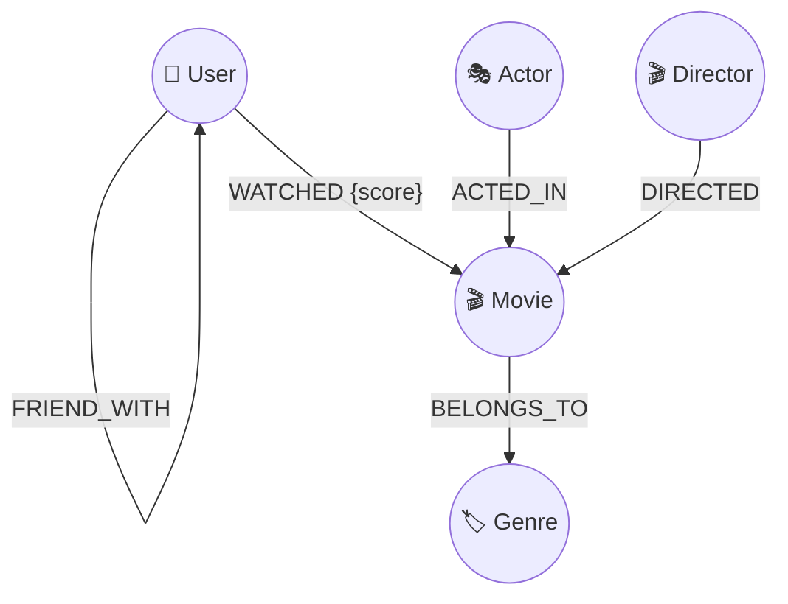

<<<<<<< HEAD
# 🎬 CineGraph - Movie Recommendation Graph Database System

> An interactive, visual **Graph Database & Recommendation Web Application** built to demonstrate property graph modeling, multi-hop Cypher traversals, and personalized recommendation algorithms.

---

## 🎯 1. Project Overview & Choice

### Why a Movie Recommendation System?
Movie recommendation is an ideal domain to demonstrate the core strengths of **Graph Databases**. Standard user recommendation relies heavily on navigating interconnected relationships:
- Users watching and rating movies
- Actors co-starring across multiple films
- Directors developing signature styles across genres
- Friends sharing movie tastes with each other

---

## ⚡ 2. Why a Graph Database is Better Than a Relational Database (SQL)

| Feature / Criteria | Relational Database (SQL) | Graph Database (Neo4j / CognoDB) |
| :--- | :--- | :--- |
| **Data Representation** | Tables, Rows, Foreign Key Columns | Nodes (Entities) and Edges (Relationships) |
| **Multi-Hop Traversals** | Requires multiple expensive `JOIN` operations ($O(N^k)$ complexity) | Index-Free Adjacency ($O(k)$ linear time complexity) |
| **Friends-of-Friends Query** | Complex recursive Common Table Expressions (CTEs) | Simple Cypher pattern matching `(u)-[:FRIEND_WITH]->(f)-[:WATCHED]->(m)` |
| **Schema Flexibility** | Rigid schema migrations for new relationship properties | Dynamic properties can be attached to nodes and edges effortlessly |
| **Path Finding / Graph Mining** | High performance penalty, requiring external tools | Native `shortestPath()` algorithms supported out of the box |

### The "SQL JOIN Problem" vs "Index-Free Adjacency"
In traditional SQL databases, discovering a 3-hop recommendation (e.g., *"Movies watched by friends of users who liked movies directed by Christopher Nolan"*) requires joining `Users`, `Ratings`, `Movies`, `Movie_Directors`, `Directors`, `User_Friends` tables together. 

As dataset size grows ($N$), joined tables explode in complexity exponentially ($O(N^k)$). In contrast, **CognoDB / Neo4j Graph Databases** utilize **Index-Free Adjacency**: each node maintains direct memory pointers to its adjacent neighbor nodes. Traversal takes $O(k)$ time proportional only to the path length $k$, irrespective of total database size.

---

## 📐 3. Graph Data Model

### Data Model Architecture


### Nodes & Properties
1. **User**: `id`, `name`, `role`, `avatar`
2. **Movie**: `id`, `title`, `year`, `rating`, `runtime`, `overview`
3. **Actor**: `id`, `name`, `image`
4. **Director**: `id`, `name`, `image`
5. **Genre**: `id`, `name`, `color`

### Relationships (Edges) & Properties
- `(User)-[:WATCHED {score: 1..5}]->(Movie)`
- `(Actor)-[:ACTED_IN]->(Movie)`
- `(Director)-[:DIRECTED]->(Movie)`
- `(Movie)-[:BELONGS_TO]->(Genre)`
- `(User)-[:FRIEND_WITH]->(User)`

---

## 📊 4. Sample Data & Seed Scripts

We provide two automated methods to seed your database:

1. **`seed.cypher`**: Raw Cypher queries containing all `CREATE` / `MERGE` statements.
2. **`seed.js`**: Automated Node.js runner script connecting directly via `neo4j-driver`.

### Running the Seed Script:
```bash
# 1. Configure environment variables in .env
cp .env.example .env

# 2. Run seed script
node seed.js
```

---

## 🔍 5. Cypher Queries

### Query 1: Display All Movies (Basic Node Retrieval)
```cypher
MATCH (m:Movie)
RETURN m.id AS Id, m.title AS Title, m.year AS Year, m.rating AS Rating;
```

### Query 2: Multi-Hop Query (2 Hops) - Friends-of-Friends Collaborative Filtering
```cypher
// Find movies watched by Alice's friends that Alice hasn't watched yet
MATCH (u:User {name: 'Alice Chen'})-[:FRIEND_WITH]->(f:User)-[r:WATCHED]->(m:Movie)
WHERE NOT (u)-[:WATCHED]->(m) AND r.score >= 4
RETURN m.title AS RecommendedMovie, 
       f.name AS WatchedByFriend, 
       r.score AS FriendRating,
       m.rating AS OverallImdbScore
ORDER BY r.score DESC;
```

### Query 3: Multi-Hop Query (3+ Hops) - Deep Content Path Discovery
```cypher
// Find movies featuring actors who acted in movies directed by Christopher Nolan
MATCH (d:Director {name: 'Christopher Nolan'})<-[:DIRECTED]-(m1:Movie)<-[:ACTED_IN]-(a:Actor)-[:ACTED_IN]->(m2:Movie)
WHERE m1 <> m2
RETURN d.name AS Director,
       m1.title AS NolanMovie,
       a.name AS CoStarActor,
       m2.title AS RecommendedMovie;
```

### Query 4: Relational-Difficult Query (Shortest Path Traversal)
```cypher
// Find the shortest relationship path between Alice and Bob (up to 5 hops deep)
MATCH path = shortestPath((u1:User {name: 'Alice Chen'})-[*..5]-(u2:User {name: 'Bob Smith'}))
RETURN path, length(path) AS HopDistance;
```

---

## 💻 6. Web Application UI Features

- **Interactive 2D Graph Canvas**: Visual force-directed graph canvas powered by Vis-Network with node dragging, zoom, filtering, and path highlighting.
- **Dynamic Recommendation Engine**: 4 distinct recommendation algorithms:
  1. *Collaborative Filtering* (2-hop social traversal)
  2. *Content Graph Traversal* (Actor, Director & Genre graph paths)
  3. *Personalized PageRank* (Random Walk Proximity)
  4. *Hybrid Recommendation Engine*
- **Cypher Query Sandbox**: Embedded query console allowing users to run custom Cypher queries live.
- **Add / Edit Data Modals**: User-friendly modal interface to submit new ratings and add node relationships.
- **Graph Topology Analytics**: Graph metrics dashboard showing node degree centrality, density, and connected components.

---

## 🔒 7. Environment Variables Setup

Database credentials are stored securely in environment variables (never hardcoded in source files):

```env
# .env file
VITE_NEO4J_URI=bolt://your-cognoDB-instance.cogno.cloud:7687
VITE_NEO4J_USER=neo4j
VITE_NEO4J_PASSWORD=your_secure_password_here
```

---

## 🚀 8. Setup & Running Locally

### Step 1: Install Dependencies
```bash
npm install
```

### Step 2: Configure Database Credentials
Copy `.env.example` to `.env` and fill in your CognoDB / Neo4j instance details.

### Step 3: Run Seed Script (Optional)
```bash
node seed.js
```

### Step 4: Start Local Web Application
```bash
npm run dev
```
Open [http://localhost:5173](http://localhost:5173) in your browser.

---

## 🌐 9. Hosting & Deployment

- **Vercel**: Push repository to GitHub -> Import project in Vercel -> Click Deploy.
- **Netlify**: Run `npm run build` -> Deploy `dist` directory.
- **Docker**: Run `docker build -t cinegraph . && docker run -p 8080:80 cinegraph`.

---

## 📽️ 10. Submission Checklist

- [x] Complete source code in GitHub Repository
- [x] Data-loading (`seed.cypher` and `seed.js`) scripts
- [x] Documented Cypher queries (`queries.cypher`)
- [x] Complete README file with Graph vs Relational analysis
- [x] Graph data model Mermaid diagram
- [x] Environment variable protection (`.env.example`)
- [x] Clean, user-friendly UI with loading and error states
=======
# cinegraph-movie-recommendation.
>>>>>>> b9a10f836d197bf3d4ec35a893dc1f31c9a15e66
